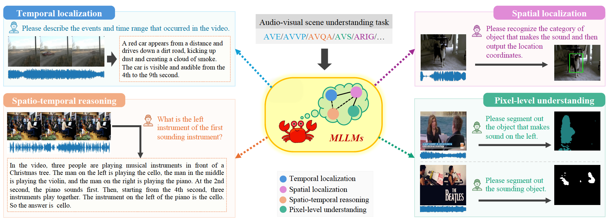

<p align="center">
    
<p>

<h3 align="center"><a href="https://arxiv.org/abs/2406.07476" style="color:#9C276A">
Crab: A Unified Audio-Visual Scene Understanding Model with Explicit Cooperation</a>(CVPR'25)</h3>
<h5 align="center"> If our project helps you, please give us a star ⭐ on GitHub to support us. 🙏🙏 </h2>

<h5 align="center">


[](https://huggingface.co/ahsgdxhs/Crab) [](https://huggingface.co/datasets/ahsgdxhs/AVUIE) [](https://arxiv.org/abs/2406.07476) <br>



## 🛠️ Requirements and Installation
Basic Dependencies:
* Python == 3.9
* Pytorch == 2.1.0
* transformers == 4.37.2
* deepspeed == 0.12.6

Install required packages:
```bash
git clone https://github.com/CserDu/Crab
cd Crab
pip install -r requirements.txt
```


## 🚀 Quick Start
1. Download [finetune weights](https://huggingface.co/ahsgdxhs/Crab)
2. Command:
```python
compute_dtype = torch.float32
    pretrain_model_name_or_path = '/dockerdata/Llama-2-7b-chat-hf'
    from models.unified_llama import UnifiedForCausalLM
    from transformers import LlamaConfig
    config = LlamaConfig.from_pretrained(pretrain_model_name_or_path, local_files_only=True)
    model = UnifiedForCausalLM.from_pretrained(
        pretrain_model_name_or_path,
        config=config,
        torch_dtype=compute_dtype
    )
    model.config.use_cache = True
    from peft_hyper import LoraConfig,get_peft_model
    lora_trainable="q_proj,k_proj,v_proj,o_proj,gate_proj,down_proj,up_proj"
    target_modules = lora_trainable.split(',')
    lora_rank = 8
    lora_alpha = 16
    lora_dropout = 0.05
    lora_nums = 3
    modules_to_save = None
    peft_config = LoraConfig(
        task_type = "CAUSAL_LM",
        target_modules = target_modules,
        inference_mode = False,
        r = lora_rank, 
        lora_alpha = lora_alpha,
        lora_dropout = lora_dropout,
        lora_nums = lora_nums,
        # modules_to_save=modules_to_save
    )
    model = get_peft_model(model, peft_config)

    from transformers import LlamaTokenizer
    tokenizer = LlamaTokenizer.from_pretrained(
        pretrain_model_name_or_path,
        padding_side="left",
        use_fast=True,
    )
    if tokenizer.pad_token_id is None:
        tokenizer.pad_token_id = tokenizer.eos_token_id

    ori_tokenizer_vocab_nums = len(tokenizer)
    model.get_model().pad_token_id = tokenizer.pad_token_id
    model.get_model().init_multimodal_modules()

    image_scale_nums = 2
    token_nums_per_scale = 3
    model.initialize_MM_tokenizer(tokenizer,mask_token_nums = image_scale_nums * token_nums_per_scale, use_vqgan=False)
    MM_tokenizer_vocab_nums = len(tokenizer)
    print('ori_tokenizer_vocab_nums: ',ori_tokenizer_vocab_nums, ' MM_tokenizer_vocab_nums: ',MM_tokenizer_vocab_nums)

    
    ckpt_dir = infer_args.ckpt_dir
    ckpt_path = join(ckpt_dir,'finetune_weights.bin')
    ckpt = torch.load(ckpt_path,map_location='cpu')
    model.load_state_dict(ckpt,strict=False)
    print(f'load ckpt from {ckpt_path} finished...')

    device = infer_args.device
    torch.cuda.set_device(device)
    model.cuda()
    model.eval()

    ## infer ref-avs
    # audio_path = '/group/40061/cserdu/data/music-avqa/audio_data/00000078.mp3'
    # image_path = 'test.png'
    # exp = 'the sounding object on the left.'
    # image_processor = model.get_model().visual_encoder.image_processor
    # inference_ref_avs(model,audio_path,image_path,image_processor,tokenizer,exp)

    ## infer avss
    # audio_path = '/group/40061/cserdu/data/music-avqa/audio_data/00000078.mp3'
    # image_path = 'test.png'
    # idx = 4
    # image_processor = model.get_model().visual_encoder.image_processor
    # inference_avss(model,audio_path,idx,image_path,image_processor,tokenizer)

    ## infer avqa
    audio_path = '/group/40061/cserdu/data/music-avqa/audio_data/00001227.mp3'
    video_path = '/group/40061/cserdu/data/music-avqa/video_data/00001227.mp4'
    question = 'What is the left instrument of the first sounding instrument?'
    image_processor = model.get_model().visual_encoder.image_processor
    inference_avqa(model,audio_path,video_path,image_processor,tokenizer,question)

    ## infer ave
    # audio_path = '/group/40061/cserdu/data/ave/AVE_Dataset/audio_data/Hhqvvc4qu2Y.mp3'
    # video_path = '/group/40061/cserdu/data/ave/AVE_Dataset/AVE/Hhqvvc4qu2Y.mp4'
    # image_processor = model.get_model().visual_encoder.image_processor
    # inference_ave(model,audio_path,video_path,image_processor,tokenizer)

    ## infer avcap
    # audio_path = '/group/40061/cserdu/data/ave/AVE_Dataset/audio_data/Hhqvvc4qu2Y.mp3'
    # video_path = '/group/40061/cserdu/data/ave/AVE_Dataset/AVE/Hhqvvc4qu2Y.mp4'
    # image_processor = model.get_model().visual_encoder.image_processor
    # inference_avcap(model,audio_path,video_path,image_processor,tokenizer)
``` 


## 🗝️ Training
1. Downlod [AVUIE dataset annotations](https://huggingface.co/datasets/ahsgdxhs/AVUIE) and raw videos from [AVE](https://github.com/YapengTian/AVE-ECCV18), [AVVP](https://github.com/YapengTian/AVVP-ECCV20), [AVS](https://github.com/OpenNLPLab/AVSBench), [Ref-AVS](https://github.com/GeWu-Lab/Ref-AVS), [MUSIC-AVQA](https://github.com/GeWu-Lab/MUSIC-AVQA), [VALOR](https://github.com/TXH-mercury/VALOR)
2. command:
```bash
bash scripts/finetune/finetun_hyper_lora.sh
```


## 🤖 Inference
```bash
bash scripts/finetune/inference_hyper_lora.sh
```


## 📑 Citation

If you find Crab useful for your research and applications, please cite using this BibTeX:
```bibtex
@article{damonlpsg2024videollama2,
  title={VideoLLaMA 2: Advancing Spatial-Temporal Modeling and Audio Understanding in Video-LLMs},
  author={Cheng, Zesen and Leng, Sicong and Zhang, Hang and Xin, Yifei and Li, Xin and Chen, Guanzheng and Zhu, Yongxin and Zhang, Wenqi and Luo, Ziyang and Zhao, Deli and Bing, Lidong},
  journal={arXiv preprint arXiv:2406.07476},
  year={2024},
  url = {https://arxiv.org/abs/2406.07476}
}
```

## 🔒 License

This project is released under the Apache 2.0 license as found in the LICENSE file.
The service is a research preview intended for **non-commercial use ONLY**, subject to the model Licenses of LLaMA and Mistral, Terms of Use of the data generated by OpenAI, and Privacy Practices of ShareGPT. Please get in touch with us if you find any potential violations.
